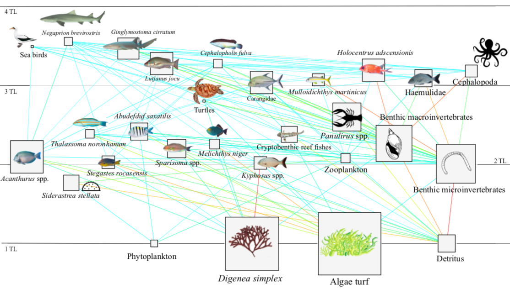
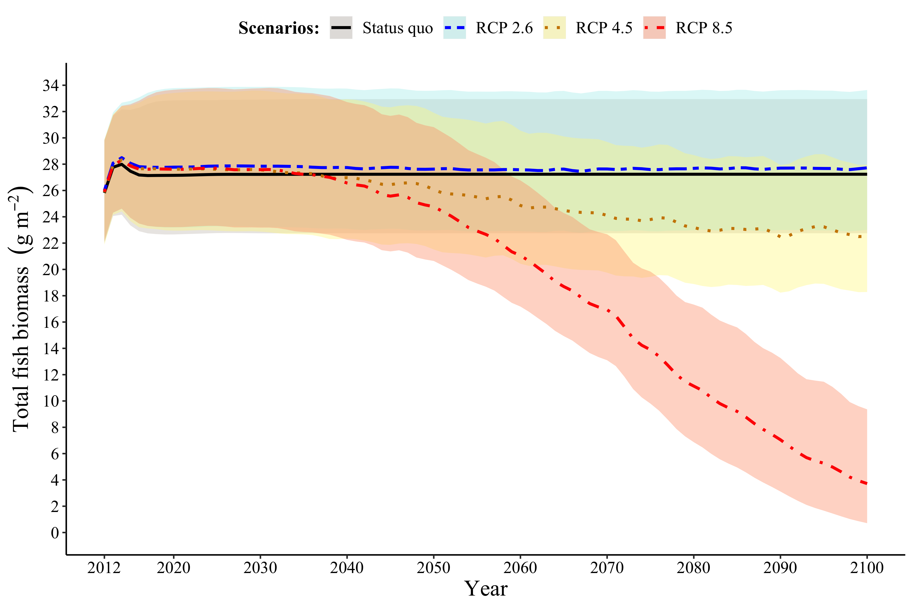
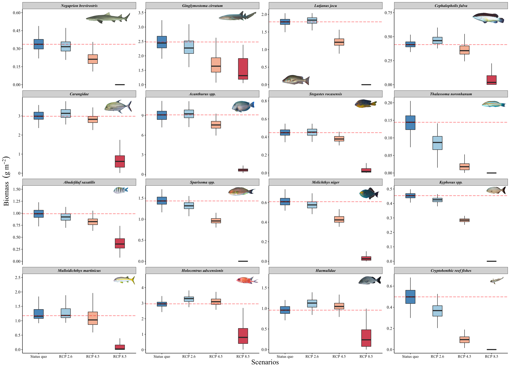

```{r setup, include=FALSE}
knitr::opts_chunk$set(echo = TRUE)

```

```{r load packages, message=FALSE,warning=FALSE, echo=FALSE}
library(readr)
library(ggplot2)
library(reshape2)
library(ggthemes)
library(magrittr)
library(ggpubr)
library(plotly)
library(tidyverse)
library(tibble)
library(pillar)
library(extrafont)
```

\newpage

# Introduction

The objective of our study was to explore the potential future effects of sea warming on the pristine reef ecosystem of the Rocas Atoll, using a food web model reflecting the 2012 year situation. The model was fitted to the best obtainable biomass time series (2012-2018) for the modelled area and it was parameterized with thermal tolerances for the species. The impact of sea warming was tested using future rising temperature under IPCC Representative Concentration Pathways (RCPs) scenarios for the modelled area. Biomass' simulations outputs were presented for several reef fish species which are identified as ecosystem keystone species (reef sharks and generalist predators) and other important compartments from different trophic guild.

# Results  

The Rocas Atoll's food web (Fig. 1) shows different groups’ trophic levels (TL): top predators are (in order): reef sharks, as _Negaprion brevirostris_ (TL=3.56), _Ginglymostoma cirratum_ (TL=3.47), sea birds (TL = 3.46) and generalist predator fish such as _Lutjanus jocu_ (TL=3.27) and  _Cephalopholis fulva_ (TL=3.28). Other groups such as microinvertrebrates and macroinvertebrates, polychaetes, amphipods, small crabs and even cryptobenthic reef fish occupied the first consumer level with trophic level between 2 and 2.2. Additionally, _Acanthurus chirurgus_, the most abundant herbivore fish at the ecosystem, has the lower trophic level (TL = 2.1). Algae (_Digenea simplex_ and algae turf) accounted for the largest proportion of total living biomass in the system (93%). Fish biomass was composed mainly by herbivore-detritivore trophic guild (53%), followed by invertivore (20%), generalist predators (18.5%) and reef sharks (8.5%).

```{r chunk_creating_figure1, echo=FALSE, fig.cap="Diagram of the food web and trophic flows of the Rocas Atoll ecosystem (year 2012). Each functional group is shown as a square and its size is proportional to the log of its biomass. The functional groups are represented by their trophic levels (y-axis) and linked by predator-prey relationships showed as coloured lines representing the relative prey’s contribution in the predator’s diet (red: >85%, orange: >75%, yellow:>50%, green: >25%, light blue:> 5%)"}

```

## Simulated biomass changes  
The best fitted model, without temperature as an ecosystem driver, was capable of reproducing historical trends in fish abundance for the period 2012-2018, with a total sum of square of 11.04 and the lowest Akaike Information Criterion (AIC) of -205.6 (Fig. 2SM/Table 3SM). The biomass accumulation rates for most fish species were positive, leading to increasing total fish biomass, a 0.7% increase from 2012 to 2100 (Fig. 2).
Our simulations showed that in Rocas Atoll, the total fish biomass would be lower by the year 2100 than at the beginning of the time series under medium (RCP 4.5) and high (RCP 8.5) emissions scenarios (Fig. 2). In contrast, under RCP 2.6 scenario, simulated changes in total fish biomass reached 0.7% increase until 2100 relative to year 2012 (Fig. 2). 


```{r chunk_import_figure2, echo=FALSE, dpi=300, fig.align= "center", fig.cap = "Means of projected historical and future total fish biomass under status quo scenario, low climate change mitigation, medium and strong climate change (emissions scenarios: RCP 2.6, RCP4.5, RCP8.5) for 2012–2100"}
# include Fig. 2 plot

```


```{r chunk_import_figure3, echo=FALSE, fig.cap= "Fish species biomass (g m^-2) estimates of the Rocas Atoll ecosystem at year 2100 for different climate change scenarios. The box plots show the median (horizontal lines), 25% and 75% percentiles (upper and lower limits of the box), and the whiskers are 1.5 times the interquartile (distance between the upper and lower box limits). Red dashed line represent the median of the “Status quo” scenario."}
# include Fig. 3 plot


```

